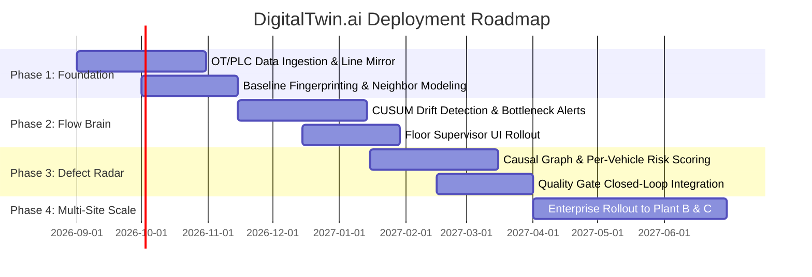

# DigitalTwin.ai — AI-Powered Digital Twin for Vehicle Assembly Lines

## Detailed Business Proposal | Accenture Innovation Challenge 2026 — Round 2

**Team:** [TEAM_NAME_PLACEHOLDER]  
**Track:** Problem Statement 4 — DigitalTwin.ai  
**Date:** August 2026  

---

## Executive Summary

Modern vehicle assembly lines lose **$20,000+ per minute** during unplanned stoppages, and end-of-line defect discovery costs **10–100× more** to fix than catching the same fault in-process. Yet most plants still rely on shift-end reports and final inspection to manage quality and throughput — tools that tell you what *already went wrong*, not what is *about to*.

**DigitalTwin.ai** delivers the **Assembly Intelligence Layer (AIL)** — a lightweight, AI-powered digital twin that models the *rhythm* of the production line rather than its 3D geometry. It predicts bottlenecks **15–30 minutes** before they become critical, scores every vehicle's defect risk in real time as it moves through each station, and functions effectively even across stations with partial or zero sensor instrumentation.

The system has been engineered specifically for real-world manufacturing constraints: mixed legacy/modern equipment, uneven sensor coverage, and zero operational disruption (no intrusive PLC modifications).

---

## 1. Problem Framing & Real-World Complexity

### 1.1 The Operational Challenge
A vehicle assembly line is a tightly coupled sequence of 30–50 stations across Body Construction, Paint, and Final Assembly. A minor 2-minute delay or parameter drift at an upstream station cascades across the entire plant:
- **Upstream**: Work-in-progress (WIP) queues build up, creating buffer overflow and line blockages.
- **Downstream**: Stations run out of work and sit starved/idle.
- **Quality**: Deviations (torque, temperature, vibration) propagate invisibly down the line until caught at expensive end-of-line inspections.

### 1.2 Five Documented Industry Problems Addressed

| # | Industry Failure Mode | Research Citation | Real-World Impact & Solution |
|---|----------------------|-------------------|------------------------------|
| 1 | **Reactive End-of-Line Inspection** | SkillReal (2024), QCAdvisor 1:10:100 Rule | Defects caught at end-of-line cost 10× more (100× if reaching customer). **Solution:** In-process *Defect Radar* scoring and intermediate Quality Gate intervention. |
| 2 | **Dynamic & Migrating Bottlenecks** | Politecnico di Milano (2024), ResearchGate | Bottlenecks shift by vehicle mix (Sedan/SUV/Truck) and cannot be caught by static reports. **Solution:** Continuous queue trend forecasting via *Flow Brain*. |
| 3 | **Sensor Blind Spots & Legacy Stations** | Taylor & Francis IJCIM (2024) | Legacy stations lack telemetry. **Solution:** Neighbor inference, soft proxy sensors (power/vibration), and Bayesian uncertainty modeling. |
| 4 | **3D Twins That Visualize But Don't Predict** | ISACA (2023), sciltp.com (2025) | 3D CAD twins look impressive but provide zero predictive value. **Solution:** Model line rhythm (cycle time vs. takt, queue depth), not geometry. |
| 5 | **AI Black-Box Distrust & Alert Fatigue** | NIH/PubMed Central (2024) | Operators ignore opaque AI alarms. **Solution:** Explained AI alerts detailing exact parameter deviations, confidence intervals, and recommended actions. |

---

## 2. Solution Architecture: Assembly Intelligence Layer (AIL)

```
┌─────────────────────────────────────────────────────────────────────────┐
│                      DATA INGESTION LAYER (OT/IT)                       │
│   PLC Signals (OPC-UA) │ Smart Torque Tools │ MES Cycle Logs │ Modbus   │
│   Power Proxies (PDU)  │ Vision Timestamps  │ Barcode Scans  │ Manual   │
└────────────────────────────────────┬────────────────────────────────────┘
                                     │
                 ┌───────────────────┼───────────────────┐
                 ▼                   ▼                   ▼
      ┌────────────────────┐ ┌────────────────────┐ ┌────────────────────┐
      │   1. LINE MIRROR   │ │   2. FLOW BRAIN    │ │  3. DEFECT RADAR   │
      │                    │ │                    │ │                    │
      │ • Station States   │ │ • Two-sided CUSUM  │ │ • Per-vehicle      │
      │ • Cycle vs Takt    │ │   Drift Detection  │ │   rolling risk     │
      │ • WIP Queue Depth  │ │ • Queue Growth     │ │   score (0-100)    │
      │ • Neighbor State   │ │   Forecasting      │ │ • Dynamic Gate     │
      │   Inference Engine │ │ • 20-min Lookahead │ │   Interception     │
      └──────────┬─────────┘ └──────────┬─────────┘ └──────────┬─────────┘
                 │                      │                      │
                 └──────────────────────┼──────────────────────┘
                                        ▼
                   ┌──────────────────────────────────────┐
                   │       EXPLAINABLE DECISION CORE      │
                   │  • Parameter Root-Cause Attribution  │
                   │  • Confidence Intervals & P(Normal)  │
                   │  • Recommended Action Dispatcher     │
                   └──────────────────┬───────────────────┘
                                      ▼
      ┌───────────────────────────────┼───────────────────────────────┐
      ▼                               ▼                               ▼
┌──────────────────┐        ┌──────────────────┐        ┌──────────────────┐
│ FLOOR SUPERVISOR │        │  PLANT MANAGER   │        │ LEADERSHIP / ROI │
│ Real-time alerts │        │ Shift KPIs & OEE │        │ Capex payback &  │
│ & actions        │        │ Chronic hotspots │        │ site scalability │
└──────────────────┘        └──────────────────┘        └──────────────────┘
```

### 2.1 The Three Core Modules

1. **Line Mirror**:
   - Maps 40 stations across Body Construction (S1–S12), Paint Shop (S13–S20), and Final Assembly (S21–S40).
   - Tracks actual cycle time vs. target takt time ($T_{takt} = 60\text{s}$) and buffer queue depths in real time.
   - For stations without sensors, runs **Neighbor Inference**: deduces upstream/downstream starvation or buildup and provides confidence intervals (e.g., $P(\text{Normal}) = 82\%$, $P(\text{Slow}) = 18\%$).

2. **Flow Brain (Bottleneck Predictor)**:
   - Uses two-sided **CUSUM (Cumulative Sum)** statistical process control to detect micro-drifts (tool wear, thermal expansion) long before static threshold alarms trigger.
   - Runs linear regression over rolling queue depth trends to compute precise **Time-to-Overflow (ETA)**:
     $$\text{ETA}_{\text{overflow}} = \frac{\text{Buffer Capacity} - Q(t)}{\text{Fill Rate}}$$
   - Issues ranked, proactive advisories (e.g., *"Station 14 buffer will overflow in ~12 min — pre-position secondary operator"*).

3. **Defect Radar (Per-Vehicle Risk Scoring)**:
   - Maintains an immutable digital passport for every vehicle ($VH\text{-}XXXX$).
   - Accumulates multi-factor risk scores ($0–100$) based on torque anomalies, thermal spikes, vibration drift, cycle-time deviations, and uncertainty penalties.
   - Evaluates vehicles at intermediate **Quality Gates (S12, S20, S40)**. If risk exceeds the High threshold ($>60$), the unit is flagged for targeted in-line inspection rather than traveling to final assembly.

---

## 3. Multi-Stakeholder Experience

- **Floor Supervisor View**: Focuses on immediate triage. Delivers color-coded station grids, time-to-overflow countdowns, and concrete operational actions without information overload.
- **Plant Manager View**: Focuses on shift health. Tracks throughput vs. target, shift defect rates, chronic bottleneck heatmaps, and zone-by-zone cycle performance.
- **Leadership & Executive View**: Focuses on financial impact. Computes avoided downtime costs ($20k/min), quality rework savings ($1:10:100 rule), and investment payback timelines ($<1.5$ months).

---

## 4. Business Case & ROI Analysis

| Category | Calculation Basis | Projected Annual Benefit |
|----------|-------------------|--------------------------|
| **Unplanned Downtime Reduction** | 2 bottleneck incidents avoided/week $\times$ 25 min $\times$ \$20,000/min | **\$52.0M / year** |
| **In-Process Rework Savings** | 15% reduction in end-of-line defects $\times$ \$1,800 cost delta | **\$1.8M / year** |
| **Prevented Recall Mitigation** | 1 potential batch recall averted (5,000 vehicles $\times$ \$10,000) | **\$50.0M (one-time)** |
| **Sensor Capex Optimization** | Virtual neighbor inference avoiding complete line re-instrumentation | **\$350K initial capex save** |

**Single-Line Deployment Cost:** ~\$750,000  
**Payback Period:** **< 30 days**

---

## 5. Phased Implementation Roadmap



---

## 6. Risk Matrix & Mitigations

| Risk Factor | Severity | Mitigation Strategy |
|-------------|----------|---------------------|
| **Legacy PLC Protocol Incompatibilities** | High | Use non-invasive edge gateways (OPC-UA / MQTT brokers) without touching PLC ladder logic. |
| **Operator Alert Fatigue** | High | Implement two-sided CUSUM filtering, adaptive thresholding, and mandatory plain-English root-cause explanations. |
| **Data Gaps at Unmonitored Stations** | Medium | Deploy soft sensors (power/vibration proxies) and probabilistic uncertainty bands ($P(\text{Normal})$). |
| **Model Drift Across Vehicle Mix Changes** | Medium | Continuous automated re-baselining per model type (Sedan, SUV, Truck). |

---

## 7. Research References & Citations

1. **SkillReal (2024)** — *Digital Twin Platforms for Early Defect Detection: Inline Inspection for Body-in-White.*
2. **SixSigmaDSI (2024)** — *End-of-Line Inspection Is an Organizational Failure: Quality at the Source.*
3. **QCAdvisor & Invensis Learning (2023)** — *The 1:10:100 Quality Management Rule.*
4. **Lugaresi, G., Matta, A., et al. (2024)** — *Digital Twin-based bottleneck prediction for improved production control*, Computers & Industrial Engineering.
5. **Taylor & Francis (2024)** — *State of the Art and Future Directions of Digital Twin-Enabled Smart Assembly Automation*, Int. J. Comput. Integr. Manuf.
6. **MDPI Sensors / NIH PMC (2024)** — *AI-Driven Digital Twins for Manufacturing: A Review Across Hierarchical Levels.*
